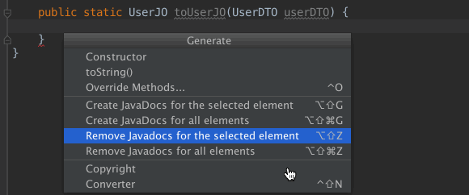
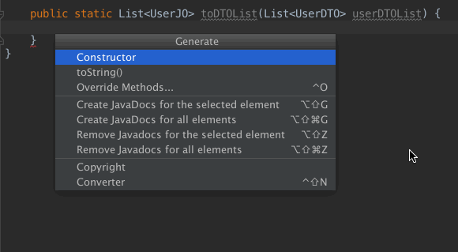

# SmartConverter -- POJO Object Converter
Intellij Idea Plugin for generating the converter method to convert one POJO bean to another. It supports single bean and list convert. It also supports the nested POJO convert.

## Usage
### Four convert methods
1. Put the caret in the class, not in any method.
2. Press Alt+Ins/CMD+N and select in menu "Smart Converter" or use shortcut Ctrl+Shit+N.
2. In the From dialog, select the Class you want to convert From.
3. In the To dialog, and select the class you want to convert To.
4. Press "Ok" and four converter methods will be added to your current class as following:

* A -&gt; B
* B -&gt; A
* List&lt;A&gt; -&gt; List&lt;B&gt;
* List&lt;B&gt; -&gt; List&lt;A&gt;

### Single convert method
1. Finish the converter method signature without any method body as below
```
    public static UserJO toUserJO(UserDTO userDTO) {

    }
```
1. Put the caret in the above method.
2. Press Alt+Ins/CMD+N and select in menu "Smart Converter" or use shortcut Ctrl+Shit+N.
2. Plugin generates the converter code according to the return type and param type of method.



####Note
 Plugin also writes in comments list of fields, that were not mapped (appropriate setter or getter is missing or different types).


# SmartConverter -- POJO转换代码生成器


## 项目背景
在分层开发中，我们总是面临着各种POJO（DTO,DO,JO,VO）对象之间的相互转换。当对象比较复杂时，编写转换代码耗时较多，且非常容易出错。以至于可能会出现写一天代码，半天在写各种convert的囧境。

为了实现自动转换，出现了BeanUtil和ModelMapper等解决方案。这些方案，在少量对象转换时，性能损耗可以忽略，但是当转换数量达到一定量级时，这种损耗会对性能产生影响。

本插件可以自动生成POJO之间的转换代码，省去手工转换的麻烦，也不会损失性能。


## 使用步骤

### 安装
下载SmartConverter.zip，并在Intellij Idea中安装；

### 四个转换函数
1. 把光标放到函数中，不能是函数内.
2. 光标移动到函数体内，按下``⌘``+``N``，在弹出的``Generate``菜单中选择``Smart Converter``;
3. 插件自动生成一下四个转换函数

* A -&gt; B
* B -&gt; A
* List&lt;A&gt; -&gt; List&lt;B&gt;
* List&lt;B&gt; -&gt; List&lt;A&gt;

### 单个抓换函数
1. 在编辑器中，确定返回值和参数，完成空转换函数;

```
    public static List<UserJO> toDTOList(List<UserDTO> userDTOList) {

    }
```

3. 光标移动到函数体内，按下``⌘``+``N``，在弹出的``Generate``菜单中选择``Smart Converter``;
4. 插件根据入参和出参推断出需要转换的POJO。


## 插件特色

> 插件自动从转换函数的参数和返回值推断出转换POJO；
> 
> 支持List之间的转换。
> > 如果存在单个转换的函数，则直接使用
> > 
> > 如果不存在单个转换的函数，创建单个转换函数
> 
> 支持嵌套转换



### 感谢

1. https://www.jetbrains.com/help/idea/plugin-development-guidelines.html
2. https://github.com/DudarevDaniel/ConverterGenerator